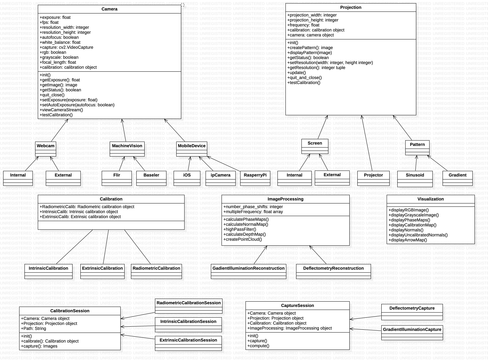

## Structured Light Open Source Framework
This open source platform aims at uniting the knowledge of different three-dimensional imaging and projection techniques, including their calibration,
image processing and visualization. Our goal is to have all modules in one place, such that the use of different cameras, projectors, calibration techniques
or image processing algorithms can be done in a straight forward manner. The classes Camera, Projection, Calibration and ImageProcessing serve as the base classes 
and contain the basic functions and parameters, which are shared by any object and are ought to be overwritten in the corresponding subclass. 
This also means that any user can create classes for their own specific cameras, projectors, etc. using their own libraries, while enabling a smooth integration.
The calibration and capture function of the imaging system are implemented as additional base classes, namely CalibrationSession and CaptureSession. Different 3D imaging techniques inherit functions and parameters from these base classes. Last but not least a simple visualization class using
matplotlib is provided to visualize images, normal maps, arrow maps, point clouds and meshes. The complete class structure is visualized in the image below.

## Installation 
Any recent Python 3 version should do, Python 3.7.4 is tested. To install the required packages, use `pip3 install -r requirements.txt`.

## Example Use
A sample on how the framework can be used is provided in a Python script (main.py) and a Jupyter Notebook (ExampleUsage.ipynb).
We create a Camera object (your internal webcam), a Projection object (your main screen)
and a ImageProcessing object (GradientIlluminationReconstruction), which we pass on to our CaptureSession/GradientIlluminationCapture. If no calibration is given, this 
is simply set to None. After initilization we call GradientIllumination.capture() to create the projections and obtain/save the image data. This data is then
used in GradientIllumination.compute() to generate phase maps and normals in the case of Gradient Illumination. Subsequently the computed data is visualized along with 
the reference images.

## Modules - Cameras
So far subclasses for internal and external webcams, Raspberry cameras and Basler machine vision cameras have been implemented. Note that some functions are 
not supported by a specific camera or operating system. Common problems here are the setting of parameters on Mac using AVFoundation, since this is not fully supported in OpenCV. 
To create a new camera in a new subclass, create a code skeleton of the inhereting class and override the functions. The camera base class consits of getters/setters for exposure, gain, resolution and fps. Moreover the camera class provides a function to take and image, open and close the camera and view the camera stream. 

## Modules - Projections
As of now, a main screen class represents the projection on a screen and a pattern class defines a series of patterns for projection. As the Tkinter GUI is 
running in it's own loop, we provide the series of all patterns to project and also pass on the camera object in the CaptureSession class, to take images once
the projected pattern changes.

## Modules - Calibrations
Calibration consists of two parts: the base class of calibration techniques and a base calibration session class. The base calibration session takes care of
generating the data required for calibration in a capture() function. E.g. radiometric calibration requires images of the same scene captured at different exposure times, 
geometric and intrinsic calibration works with markers placed on the scene imaged from different viewing directions. Once the capture() process is done, the acquired data
can be used for calibration by calling the compute() function of the respective calibration technique. 

## Modules - ImageProcessing - Reconstructions
Different reconstruction techniques and image processing options can be stored in the folder /Reconstructions, which until now, contains the 
GradientIlluminationReconstruction. In this class the phase maps, normals, meshes and point clouds are computed.
